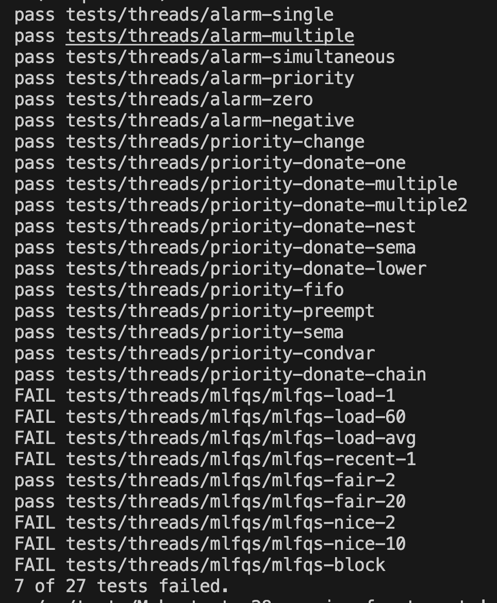
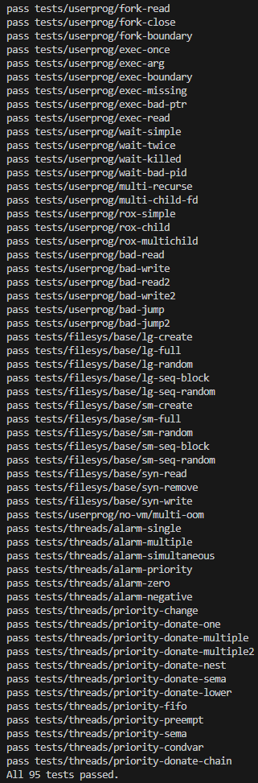
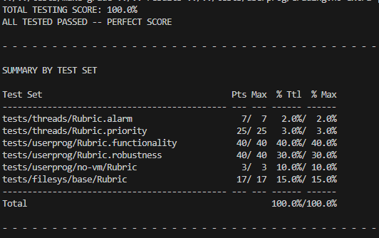
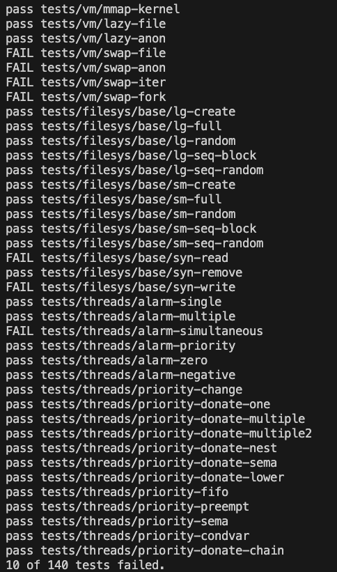
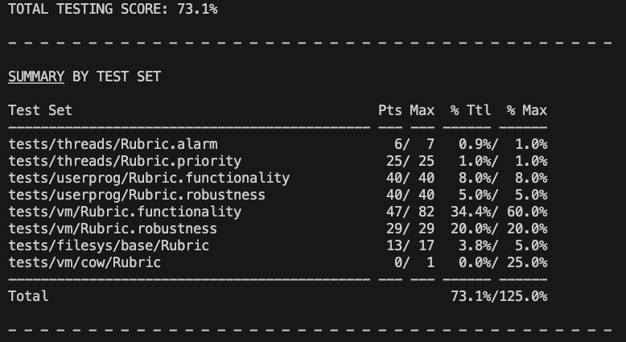

# Project 1 : Threads
운영체제가 프로그램으로부터 실행 흐름을 생성하는 것은 기본적으로 쓰레드를 통해 만들어 낸다.
쓰레드의 기본 틀은 구현되어 있었으며, 몇몇의 비효율적인 구조들을 개선시키는 식으로 진행됐다.

## 쓰레드 sleep시, **바쁜 대기** 방식에서 쓰레드를 block 시키는 **알람 클럭** 방식으로 개선  
기존 바쁜 대기 방식은, 쓰레드가 실행 흐름을 가진 뒤 대기 상태면 양보하는 방식으로 CPU 사이클을 낭비시키고 있었다. sleep시 쓰레드를 대기 상태로 전환 시킨 뒤, 스케쥴링 리스트에서 빼내어 별도의 sleep list로 관리했다.

### P1. sleep list에서 스레드 삭제가 안됨 
**대기를 마친 쓰레드가 sleep list에서 삭제되어 다시 스케쥴링 리스트에 들어가야하나, 삭제되지 못하고 남아 있었다.**  

```
함수 호출 순서 문제였다. list_push_back 함수는 리스트에 해당 요소를 추가하는데 
이 때 prev와 next값을 연결시켜주게 된다.  
list_pop_front 함수는 해당 요소의 앞뒤의 연결을 끊는다. 
따라서 함수 실행 흐름은 sleep list에서 list_pop_front를 먼저 호출하여 연결을 끊은 뒤,
list_push_back을 통해 스케쥴링 리스트에 추가해줘야 했다.
```

## 쓰레드의 중요도에 따라 실행 흐름을 먼저 가지는 우선순위 스케쥴러 구현  
각 쓰레드별로 중요도별로 실행 흐름을 가질 수 있어야 했으며, 높은 중요도를 가지는 쓰레드가 sleep 상태에서 깨어나도, 곧바로 실행 흐름을 가져갈 수 있어야했다. 락을 가지는 경우에도 동일하게 동작해야했다.

### P1. 우선순위 역전 현상
**낮은 우선순위를 가지는 쓰레드가 락을 가지고 있어, 동일한 락이 필요한 쓰레드가 대기 상태에 있는데, 이 쓰레드보다는 낮지만, 현재 쓰레드보다는 높은 우선순위를 가지는 쓰레드가 진입하면 먼저 실행됐다.**

```
우선순위 기부를 도입했다. 쓰레드에 우선순위 목록을 가지게 했다. 자신보다 우선순위가 낮은 쓰레드가 락을 갖고 있을 시,
자신의 우선순위를 해당 쓰레드에 똑같이 적용시켜주고 목록에 추가시킴으로써, 순서를 보장할 수 있었다.
```

### P2. 락이 중첩될 경우 우선순위 역전 현상
**락을 가지고 있는 상태에서 다른 락을 기다리고 있는 상황에서 여러 쓰레드가 중첩될 경우, 우선순위가 보장되지 않았다.**  

```
중첩된 쓰레드를 탐색할 수 있게 기다리는 락에 대한 상태를 추가했다.
쓰레드가 대기 상태로 진입할 때, 이 를 통해 쓰레드들을 탐색하여 자신보다 낮은 쓰레드에게 우선순위를 기부해줬다.
```

**중첩된 상태와 여러 쓰레드가 락을 대기하고 있는 혼합된 상태에서, 순서가 제대로 지켜지지 않았다.**  

```
쓰레드가 락을 반납할 때 우선순위를 재조정해주는 과정이 필요했다.
쓰레드가 기부받은 우선순위 중에서 가장 높은 우선순위로 갱신시켜줬다.
```

**중첩된 상태에서 락을 반납하고 다음 실행될 쓰레드를 wait list에서 꺼내오는 과정에서 가장 높은 우선순위를 가지는 쓰레드가 선정되지 않았다.**   

```
wait list를 정렬해준 뒤 우선순위가 가장 높은 쓰레드를 선정했다.
락이 중첩될 때, 기다리는 락에 대한 상태를 통해 쓰레드들을 탐색해나가며 우선순위를 재조정해줬는데,
이 과정에서 wait list에 있는 쓰레드들의 우선순위 또한 변경시켰다.
이로 인해, wait list에 있는 쓰레드의 우선순위 순서를 보장할 수 없었다.
따라서 락을 반납하고 다음 쓰레드를 wait list에서 빼내올 때 정렬이 필요했다.
```

## 알게된 점
- 커널 레벨에서는 동기화를 위해 인터럽트를 끌 수도 있다는 것을 알게 됐다.
- 락과 컨디션 변수 등을 사용해서 임계 영역에 접근하는 쓰레드를 제한할 수 있었다.
- 어셈블리어까지는 원자적 연산을 지원하다는 것을 알게 됐다.
- CPU 가상화를 구현한 시분할 메커니즘에 대한 이해와 여러 스케쥴링 정책을 학습했다.
- 페어 프로그래밍을 진행했고, 여러 시행착오를 겪으며 개선된 페어 프로그래밍 방식을 정립했다.

## 테스트 결과


# Project 2 : User Program
운영체제 위에서 돌아가는 사용자 프로그램이 운영체제가 관리하는 컴퓨터 자원들에 접근하려면 운영체제가 그러한 인터페이스를 제공해줘야했다. 운영체제는 사용자로부터 자원을 보호(protection)하고 서로가 영향을 끼칠 수 없게 고립(isolation)시켜야 할 책임이 있기 때문이다. Project 1에서는 커널 모드만 생각하면 됐지만, 이제는 유저 모드도 고려해야했다. 유저 모드가 안전하게 자원을 사용할 수 있도록 시스템 콜을 제공했어야 했고, 이에 대한 구현을 진행했다. 

사용자 프로그램이 운영체제로 전달하는 정보는 레지스터에 담겨있었고, 이 레지스터 값들을 모아놓은 구조체로 인터럽트 프레임이 있었다.

## fork, exec, read, write 따위의 시스템 콜 구현
유저 풀로부터 메모리를 할당받아, 유저 스택에 스택 포인터를 조작해가며 명령어 인자로 들어온 값들을 직접 넣어줘야 했으며, 기본으로 제공된 파일 시스템 코드를 통해 I/O 작업을 구현해야했다.

### P1. 실행중인 파일에 쓰기 작업 시도
**fork 또는 exec를 통해 새로운 프로세스를 생성하는데, 이 프로세스가 현재 실행중인 파일에 대한 쓰기 작업을 한다면 막아야했다. 그러나, 실행 파일을 불러오는 함수가 실행 파일을 로드하고 현재 실행 파일에 대한 자원을 해제시키면서 쓰기가 가능한 문제가 발생했다. 이미 자원 해제가 되었기에 현재 프로세스가 지닌 상태로는 자원에 대한 쓰기 작업을 막을 수 없었다.**  

```
실행 파일에 대한 상태를 추가했다. 파일 로드시 바로 파일에 대한 자원을 해제시키지 않고,
실제로 프로세스가 종료되는 시점에서 파일 자원을 해제시켰다.
```

### P2. 자식 프로세스 id(pid)를 찾지 못하는 이슈  
**fork시 thread를 생성하면서 새로운 프로세스를 생성한다. fork를 호출한 부모 프로세스는 자식 프로세스 리스트를 관리하는데, 자식 프로세스가 필요한 정보를 생성해내는 함수에서 이 리스트에 넣어준다. 그러나 부모 프로세스가 직전에 fork를 통해 만들어낸 자식 프로세스의 id를 찾지 못했다.**  

```
자식 프로세스 추가 시점을 변경하고, fork가 끝날 때까지 대기하기 위한 세마포어를 도입했다.
```

**wait시 부모 프로세스는 인자로 받은 자식 프로세스의 종료를 기다리다, 반환된 종료 상태를 그대로 반환해야했다. 자식 프로세스가 exit하는 과정에서, 부모 프로세스가 가지는 자식 프로세스 리스트에서 자신을 제거했는데, 이로 인해 부모 프로세스가 wait에 의한 대기를 하려는 시점에서 자식 프로세스를 조회할 수 없었다.**    

```
종료 대기를 위한 세마포어를 도입했다. fork시 자식 프로세스가 먼저 실행되고 부모 프로세스가 실행 흐름을 받아오는데,
이 과정에서 자식 프로세스가 없다면 wait이 실패하게 된다. 자식 프로세스는 exit시 종료 세마포어를 내려 대기하고,
부모 프로세스가 자식 프로세스의 응답 코드를 읽어온 뒤 종료 세마포어를 올려주면서 자식 프로세스가 종료되게 하였다.
다른 방법으로는 부모 프로세스에 자식 프로세스의 종료 상태들을 담아 놓을 상태를 추가하고,
자식 프로세스가 종료시에 자신의 종료 상태를 추가해주는 방법이 있었다. 
```

### P3. fork시 여러 정보 전달
**fork를 통해 생성해낸 자식 프로세스는 fork 시스템 콜을 호출한 시점부터 시작하여 실행 흐름을 이어나간다. 이를 위해선 부모 프로세스의 실행 흐름에 대한 정보가 인터럽트 프레임을 자식 프로세스의 인터럽트 프레임에 복사하는 과정이 필요했다. 시스템 콜로부터 사용자 프로그램의 실행 흐름이 담긴 인터럽트 프레임을 받아올 수 있었다. fork시에 부모 프로세스 자체와 인터럽트 프레임 두개가 필요한데, 함수의 인자값은 하나만 받게 설계되어있다.**  

```
이중 포인터를 활용했다. 함수의 인자가 void 타입의 포인터를 인자값을 받고 있었다.  
기존의 구조를 수정하고 싶지 않았기에, 배열 또한 포인터로 접근할 수 있는 것을 활용하여, 
인터럽트 프레임과 부모 프로세스를 포인터 배열에 담아줬고, 인자값으로 넘겨줬다.   
넘겨받은 인자는 이중 포인터로 캐스팅하여 사용했다. 
함수에 값만 전달하고 사라져도 되므로, 동적 할당 또는 구조체 생성은 따로 하지 않았다.
```

### P4. fork시 자식 프로세스 반환값 이슈   
**fork 시스템 콜은 process_fork라는 함수를 호출하면서 자식 프로세스를 생성해낸다. 이 때 부모 프로세스는 자식 프로세스의 pid를 반환받고, 자식 프로세스는 0을 반환하면서 둘을 구분시킬 수 있었다. 그러나 실제로 fork 작업을 하는 __do_fork 함수는 반환 값을 갖지 않는 함수였다. 반환 값을 갖지 않는 함수가 반환을 해야 하는 상황이다.**    

```
인터럽트 프레임을 활용했다. 인터럽트 프레임에는 함수의 반환값을 담는 레지스터인 rax 레지스터 정보가 담겨있다. 
이 rax 레지스터에 값을 담아줌으로써 실제 함수는 반환값이 정의되지 않았지만, 자식 프로세스는 pid를 0으로 반환할 수 있었다.
```  

### P5. 파일 디스크립터 테이블 메모리 이용도 및 접근 속도 개선 및 개발 환경 이슈  
**리눅스에서 장치들은 파일로 추상화되어있다. 사용자는 파일에 직접 접근할 수 없고, 파일에 대한 포인터인 파일 디스크립터를 통해 접근해야한다. 파일 디스크립터 테이블을 리스트로 구현했다. open 시스템 콜 호출시 파일 디스크립터를 생성했으며, read와 write시에 활용했다. fork시 부모 프로세스의 파일 디스크립터 테이블을 복제시켰다.**  

**multi-oom 이라는 테스트는 운영체제가 fork를 할 수 있는 데까지 진행한 뒤 제거하고 이 과정을 10번 반복하는 테스트이다. 이 과정에서 처음 생성된 프로세스 갯수와 동일하게 생성되는 지를 확인하면서 자원 관리에 대한 검사를 한다.**

**multi-oom 테스트에서 생성되는 프로세스가 30, 40개 정도였으며, 속도가 매우 느렸다. 반복 횟수를 1, 2회로 줄여야 겨우 결과값이 반환되는 문제가 발생했다.**

```
자료구조를 리스트에서 배열로 변경했다. 잦은 조회(복제 과정, open)가 일어났고, 
파일 디스크립터 테이블에도 제한값이 있다는 것을 알게 되어, 
고정 크기 배열로 변경했다. 
생성되는 프로세스가 180개로 늘어났고 속도도 이전보다는 개선됐으나, 
여전히 테스트를 통과하기에는 느렸다.  

파일 관련 함수에는 동기화가 필요하여 락을 걸어주었었다. 특정 시점에서 데드락과 같은 상태에 놓였을거라 판단하여 
우선 모든 락을 제거해주었다. 
2번 반복까지는 가능했으나 여전히 3번을 넘어가면 TIMEOUT이 발생했다.  

테스트 도중 CPU 상태를 확인했다. CPU 사용률이 300% 였다. 
뭔가 이상하다고 생각되어, 팀원의 개발 환경에서 테스트를 진행했다. 
자료구조를 바꾼 시점에서, 팀원의 개발 환경에서는 테스트가 통과했다. 
팀원의 개발 환경은 window에 WSL로 ubuntu를 구동시키는 환경이였다.

내가 pintOS를 구동시키는 환경은 M1, Mac OS에 docker를 통해 amd64 ubuntu를 구동시키는 환경이였다. 
M1 Mac에서 x86-64 아키텍처를 지원하려면 Rosetta를 거쳐서 실행된다. 
이 과정으로 인해 성능저하가 발생했고, 성능의 한계로 인해 정상적인 동작이 되지 않는다는 것으로 판단했다.
```  

## 알게된 점
- 이론으로 배운 쓰레드와 프로세스는 완전히 분리된 개념이였다. 그러나 구현의 관점에서는 결국 실행 흐름이라는 것에서 이 둘은 같게 볼 수 있었다. 가지고 있는 정보의 양이 적은 경량 쓰레드가 이전에 알던 쓰레드였고, 부가 정보가 많은 쓰레드가 프로세스였다.
- 운영체제는 커널 모드와 유저 모드로 나눠져 동작하며, 주소 공간 또한 나눠진다는 것을 이해했다.
- 운영체제도 하나의 프로그램이며 똑같이 메인 쓰레드를 통해 실행되고 종료됨을 깨달았다.
- 어셈블리어를 경험했고, 레지스터에 어떤 값들이 담기는 지를 알 수 있었다.

## 테스트 결과



# Project 3 : Virtual Memory
이제껏 사용하던 메모리 주소 공간은 실제 물리 메모리 공간에 의해 제한되었다. 물리 메모리 크기를 극복하기 위해 페이지를 효율적으로 다뤄야했고, 이를 위해 디스크 또한 사용할 수 있어야 했다. 

## 페이지 Lazy loading, 사용자 스택 크기 증가, 파일 메모리 매핑 구현

### P1. 파일을 읽어 메모리를 할당해주는 과정에서 페이지 폴트 발생
**실행 파일을 메모리에 적재하는 시점에서 유저 스택을 만들어 주고, 유저 스택 위치에 가상 페이지와 물리 페이지를 연결시킨 뒤, 전달받은 인자값들을 스택에 넣어준다. 실제로 매핑된 위치에 이 값들을 넣는 과정에서 이미 매핑되어 있는 주소에서 페이지 폴트가 발생했다.**  

```
스택 포인터 값에 직접 접근했다. 직접 접근시에 페이지 폴트가 일어나는 것을 확인하고, 
물리 메모리가 매핑되지 않다고 판단했다. 가상 페이지가 생성되어 있지 않았다. 
물리 페이지 할당 로직은 문제가 없었다. 
보조 페이지 테이블에 삽입, 조회 함수를 확인했고, 포인터를 잘못 전달하고 있었다. 
두 함수 모두 보조 페이지 테이블이 가지는 해시를 참조하고 있었는데, 보조 테이블의 포인터를 전달하고 있었다. 
인자값으로 해시를 전달하게 함으로써 해결할 수 있었다. 
```

### P2. 보조 페이지 테이블 복사시 NULL 값 발생
**fork시 부모 프로세스의 보조 페이지 테이블을 자식 프로세스에게도 동일하게 복제하게 된다. fork는 정상적으로 진행됐으나, 자식 프로세스의 복제된 보조 페이지 테이블에 올바른 데이터가 담겨있지 않았다.**  

```
복사하는 페이지 대상을 변경했다. 보조 페이지 테이블에 페이지 복제시, 유저 가상 메모리에 담긴 값을 복사하고 있었다. 
실제 값들은 커널 가상 페이지에 저장됐으며, 커널 가상 페이지에 담긴 실제 값을 복사해줘야 했다.
```  

### P3. 프로세스 종료시, 파일 변경 사항 미적용
**프로세스가 종료될 때, 파일 기반 페이지 같은 경우에 변경 사항이 있을 시 디스크에 기록해야했다. 실제 디스크에 적용된 값은 0으로 아무것도 기록되지 않는 것과 비교하는 문제가 발생했다. 테스트 코드에서 요구하는 로직과 달라서 생긴 문제였다.**

```
프로세스 종료 전에 파일 기반 페이지들이 destory시 해야 하는 동작들을 실행시켰다. 
원래 로직에서는 부모 프로세스에게 종료 상태만 넘겨주고, 파일 기반 페이지를 destroy 하는 자원 해제 로직을 진행했었다. 
하지만 테스트 코드에서는, 부모 프로세스에서 자식 프로세스가 변경한 파일의 변경사항을 확인하므로 
종료 상태를 넘겨주는 로직과 함께 파일 변경사항을 적용시켜야했다. 
destroy 하는 로직에는 변경 사항을 디스크에 기록하고, 메모리 매핑을 해제시킨다.
```

### P4. 동기화 이슈
**page-merge-par, page-merge-mm, syn-write, syn-read와 같은 테스트 코드가 통과되지 못했다. 이 테스트들은 같은 실행 파일을 여러 개를 실행시키고, 그 과정에서 실행 파일이 메모리에 적재되지 않는 문제가 발생했다.**

```
파일을 직접적으로 삭제하는 로직이 없기에 파일을 읽거나 여는 시점에서 발생한 동기화 문제라고 생각했다. 
모든 시스템 콜에 락을 얻게 하고, 지워나가는 식으로 락이 필요한 시점을 찾아나갔다. 
exec 시스템 콜이 직접적으로 파일을 적재했는데, 이곳에 락을 걸어줌으로써 load로 인해 생기는 문제를 해결할 수 있었다. 
그러나 이 또한, 간헐적으로 0x18과 같은 인터럽트 핸들러를 찾지 못하는 페이지 폴트가 발생했고, 랜덤으로 테스트가 통과되었다.

파일 시스템 관련 코드에 원자적 연산을 적용시키기 위해, 관련 함수에 락을 도입했으나, 동일한 문제가 발생했다.
```

## 알게된 점
- 메모리 가상화의 원리와 필요성을 이해했다.
- 익명 페이지와 파일 기반 페이지를 알게 됐고 둘의 차이를 이해했다.
- 페이지를 효율적으로 사용하기 위해 사용된 lazy loading을 구현하면서 원리를 이해했다.
- 여러 페이지 교체 알고리즘을 학습했다.
- 인터럽트 프레임 주소(낮은 주소)에서 페이지 폴트가 발생하면, 디버깅시 원인 파악에 매우 큰 어려움을 겪었다. 
- 동기화를 지원하는 자료구조가 있는 환경에 대한 감사함이 생겼다.
- 커널과 유저는 각자 다른 메모리 풀을 사용하고 있다는 것을 알게 됐다.
- 페이지 테이블을 실제 구현 가능하게 만든 것이 MMU인 것을 알게 됐고 TLB에 대한 이해를 키웠다.

## 테스트 결과



---
***Brand new pintos for Operating Systems and Lab (CS330), KAIST, by Youngjin Kwon.***  
***The manual is available at https://casys-kaist.github.io/pintos-kaist/.***
